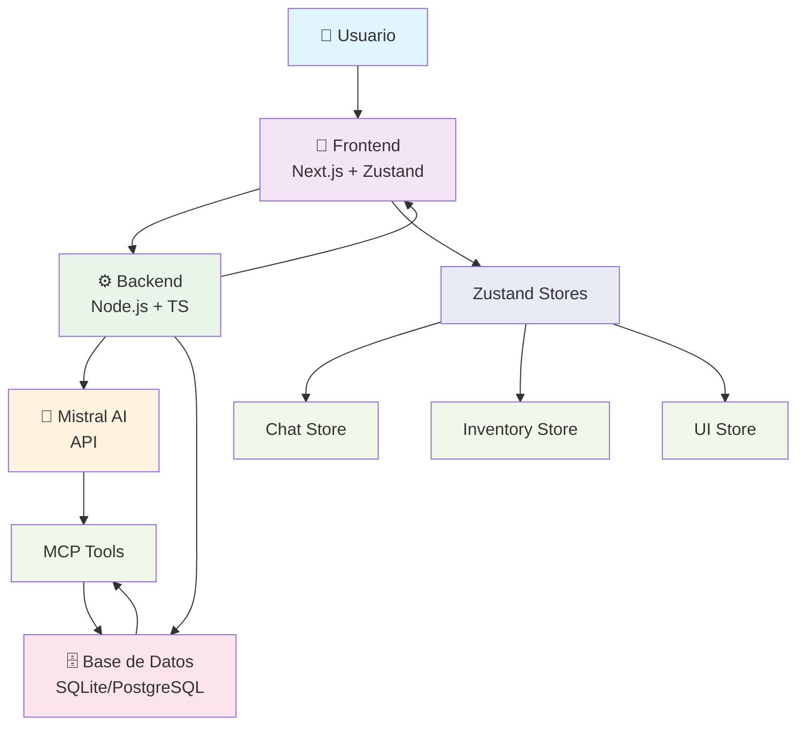

# 💄 Asistente de Inventario con IA (Cosméticos)

[](https://opensource.org/licenses/MIT)
[](https://nodejs.org/)
[](https://www.typescriptlang.org/)
[](https://www.prisma.io/)

🤖 **Asistente de inventario con inteligencia artificial orientado a tiendas de cosméticos y perfumerías.**
Permite consultar stock, analizar ventas y recibir recomendaciones automáticas de reposición a través de una interfaz tipo chat + dashboard, usando un stack moderno (Node.js, TypeScript, Prisma, LLM open‑source y MCP).

## 📊 Estado del Proyecto

- ✅ **Documentación completa** - Arquitectura, features, instalación, roadmap
- 🚧 **Implementación en desarrollo** - Backend, MCP, integración Mistral API, UI

Este proyecto está pensado como **prototipo de portfolio** para mostrar habilidades de:
- 🧠 IA aplicada a un caso real de negocio
- ⚙️ Backend moderno + base de datos + lógica de negocio
- 🔗 Orquestación de herramientas vía Model Context Protocol (MCP)
- 🎨 Diseño de una UI simple orientada a usuarios no técnicos

## 📋 Índice

- [📖 Descripción general](#descripción-general)
- [🚀 Quick Demo (cuando esté implementado)](#quick-demo-cuando-esté-implementado)
- [🏗️ Diagrama de Arquitectura](#diagrama-de-arquitectura)
- [✨ Características principales](#características-principales)
- [🏗️ Arquitectura de alto nivel](#arquitectura-de-alto-nivel)
- [🛠️ Stack tecnológico](#stack-tecnológico)
- [🗄️ Modelo de datos](#modelo-de-datos)
- [🧮 Lógica de negocio y reasoning de la IA](#lógica-de-negocio-y-reasoning-de-la-ia)
- [🤖 IA y orquestación con MCP](#ia-y-orquestación-con-mcp)
- [🖥️ Interfaz de usuario (UI)](#interfaz-de-usuario-ui)
- [🚀 Instalación y configuración](#instalación-y-configuración)
- [💬 Uso y ejemplos de consultas](#uso-y-ejemplos-de-consultas)
- [⚠️ Limitaciones actuales](#limitaciones-actuales)
- [🔮 Roadmap y visión futura](#roadmap-y-visión-futura)
- [📁 Estructura del repositorio](#estructura-del-repositorio)
- [📜 Licencia](#licencia)
## 📖 Descripción general

### 🚨 Problema
Pequeñas y medianas tiendas de cosmética suelen gestionar su inventario con **Excel** o sistemas básicos. Esto implica:
- 📊 Revisión manual de stock y ventas
- ⚠️ Quiebres de stock en productos clave
- 📦 Sobrestock en productos de baja rotación
- 🎯 Decisiones de compra basadas en intuición, no en datos

### 💡 Solución
Un **asistente de inventario con IA** que:
- 💬 Responde en lenguaje natural preguntas como:
  - *"¿Qué tengo que reponer esta semana?"*
  - *"¿Qué productos están por agotarse?"*
  - *"¿Qué tengo en sobrestock?"*
- 🔍 Consulta la base de datos de inventario y ventas
- 📈 Aplica reglas simples de negocio para:
  - Detectar riesgo de quiebre de stock
  - Identificar sobrestock / productos estancados
  - Resaltar productos estratégicos
- 🗣️ Devuelve respuestas explicadas, no solo números

### 🎯 Objetivo de portfolio
Demostrar la capacidad de:
- 🏗️ Diseñar y construir un **sistema end‑to‑end**: IA + backend + BD + UI
- 🤖 Aplicar razonamiento con IA sobre datos reales
- 💼 Pensar en términos de producto y no solo de código

## 🚀 Quick Demo (cuando esté implementado)

> **Estado**: Documentación completa. Implementación pendiente.

Esta sección muestra cómo funcionará la aplicación una vez implementada:

### 📱 Interfaz Principal
```
┌─────────────────┬───────────────────────────────┐
│ 📊 Dashboard   │ 💬 Chat con IA                 │
├─────────────────┼───────────────────────────────┤
│ 🟢 Serum X      │ Usuario: ¿Qué reponer?        │
│ 🟡 Crema Y      │                               │
│ 🔴 Labial Z     │ IA: Esta semana conviene      │
│ 📈 Top Ventas   │ reponer 15 unidades del Serum │
│ 1. Serum X      │ X. Stock actual: 8 unidades.  │
│ 2. Crema Y      │                               │
└─────────────────┴───────────────────────────────┘
```

### 🔄 Funcionalidades Clave
- **Chat conversacional**: Consultas en lenguaje natural
- **Dashboard visual**: Alertas de stock, tendencias, productos estratégicos
- **Recomendaciones inteligentes**: Basadas en ventas y proyección de demanda

### 📋 Checklist de Implementación
- [ ] Backend + Prisma + base de datos
- [ ] MCP Tools para consultas de inventario
- [ ] Integración con API de Mistral AI
- [ ] UI Chat con historial de conversación
- [ ] Dashboard con gráficos y alertas
- [ ] Lógica de negocio y reglas de reposición

## 🏗️ Diagrama de Arquitectura



**Componentes principales:**
- **Frontend**: UI intuitiva con chat + dashboard visual
- **Backend**: API REST con integración MCP
- **IA**: Mistral AI para procesamiento de lenguaje natural
- **Base de Datos**: Inventario y ventas históricas
- **MCP Tools**: Puente entre IA y datos de negocio

## ✨ Características principales

- 💬 **Chat con IA** para consultas en lenguaje natural
- 📊 **Dashboard visual** con:
  - Lista de productos
  - Estado de stock (colores)
  - Alertas de bajo stock y sobrestock

### 🎯 Casos de uso soportados
- 🔍 Consultar stock de un producto
- ⚠️ Ver productos próximos a agotarse
- 📦 Obtener recomendaciones de reposición semanal
- 📈 Ver tendencias de ventas de un producto
- 🏪 Detectar productos estancados / sobrestock
- ⭐ Ver estado de productos estratégicos

### 🗣️ Explicaciones de la IA
- Justifica por qué recomienda reponer, pausar compras o revisar un producto
- **Modelo de datos realista**: incluye precio, proveedor, fecha de última reposición, margen básico, etc.
- 🤖 **API de Mistral AI**: Modelos potentes y consistentes para procesamiento de lenguaje natural
## 🏗️ Arquitectura de alto nivel

### 🧩 Componentes

#### 🎨 Frontend (UI)
- **Next.js (React)** - Framework moderno para React
- **Pantallas principales**:
  - 💬 Chat con el asistente
  - 📊 Dashboard de inventario (lista, estado, alertas, gráficos simples)

#### ⚙️ Backend / Servidor MCP
- **Node.js + TypeScript** - Backend robusto y tipado
- **ORM Prisma** - Manejo de base de datos
- **Base de datos**: SQLite (desarrollo) / PostgreSQL (producción opcional)
- **Tools MCP expuestas**:
  - 🔍 Consultar stock
  - 📋 Generar reportes (bajo stock, sobrestock, productos estratégicos)
  - 📈 Consultar tendencias de ventas

#### 🤖 Motor de IA
- **API de Mistral AI** (modelos como mistral-medium o mistral-large)
- **Rol**: Asistente principal que:
  - Entiende el mensaje del usuario
  - Decide qué tools MCP llamar
  - Combina resultados y genera respuestas explicativas

### 🔄 Flujo de datos (simplificado)
1. 👤 **Usuario** escribe en el chat (UI)
2. 🌐 **Frontend** envía consulta al backend (`/api/chat`)
3. 🖥️ **Backend**:
   - Llama al modelo de IA con historial de conversación
   - Modelo decide tools MCP (ej. `getLowStockReport`)
4. 🔧 **Servidor MCP** ejecuta tool:
   - Consulta BD vía Prisma
   - Devuelve datos JSON al modelo
5. 🧠 **Modelo** genera respuesta en lenguaje natural:
   - Explica hallazgos
   - Recomienda acciones (reposición, revisión, etc.)
6. 📤 **Backend** reenvía respuesta al frontend
7. 🔄 **Frontend** actualiza:
   - Chat
   - Dashboard (resaltando productos críticos)
## 🛠️ Stack tecnológico

### ⚙️ Backend
- **Lenguaje**: Node.js + TypeScript
- **ORM**: Prisma
- **Base de datos**:
  - 🗄️ Desarrollo/Demo: SQLite (archivo local)
  - 🐘 Producción (opcional): PostgreSQL
- **Servidor MCP**: Implementado en Node.js con tools conectadas directamente a la BD

### 🤖 IA
- **API de Mistral AI**: Modelos como mistral-medium o mistral-large
- **Ventajas**: Rendimiento consistente, sin necesidad de ejecutar modelos localmente

### 🎨 Frontend
- **Framework**: Next.js (React)
- **Estado global**: Zustand (librería ligera para manejo de estado)
- **Patrones**: SRP, DRY, barrel exports
- **Estilos**: TailwindCSS / CSS Modules (a elección)
- **Componentes principales**:
  - 💬 Componente de chat
  - 📊 Tabla de inventario
  - 🎯 Indicadores visuales (chips, badges, colores)

### ❓ Por qué este stack
- 🎯 **Stack conocido** por recruiters (Node, TS, Prisma, React)
- 🔗 **Uso de MCP** para mostrar orquestación de tools por IA (tendencia actual)
- 💰 **API de Mistral AI** → modelos potentes con política de precios transparente
- 🚀 **Next.js** → facilita una UI clara para perfiles no técnicos
## 🗄️ Modelo de datos

Para el MVP se utiliza una tabla principal `Product`.
Se pueden añadir más tablas (por ejemplo, `Sales`) en futuras versiones.

### 5.1 Tabla `Product`

Campos sugeridos:

| Campo              | Tipo      | Descripción |
|--------------------|-----------|-------------|
| `id`               | string/int | Identificador único |
| `sku`              | string    | Código interno del producto |
| `name`             | string    | Nombre del producto |
| `brand`            | string    | Marca |
| `category`         | string    | Categoría (serum, crema, maquillaje, etc.) |
| `supplier`         | string    | Proveedor principal |
| `stock`            | int       | Stock actual en tienda |
| `stock_in_transit` | int       | Stock en tránsito / pedido en curso (opcional) |
| `sales_last_7`     | int       | Unidades vendidas en los últimos 7 días |
| `sales_last_30`    | int       | Unidades vendidas en los últimos 30 días |
| `last_restock_date`| date      | Fecha de última reposición |
| `cost_price`       | float     | Costo unitario |
| `sale_price`       | float     | Precio de venta |
| `margin`           | float     | Margen estimado (puede ser calculado) |
| `threshold`        | int       | Umbral de alerta de bajo stock |
| `is_strategic`     | boolean   | Marca productos estratégicos (alto margen/alto volumen) |

> **Nota**: La implementación concreta puede variar (por ejemplo, `margin` calculado en consultas en vez de almacenado).

## 🧮 Lógica de negocio y reasoning de la IA

### 6.1 Reglas básicas de reposición (MVP)

Ejemplo de reglas simples:

**Promedio de ventas 7 días**
```txt
promedio_diario_7d = sales_last_7 / 7
```

**Proyección a 7 días**
```txt
proyección_7d = promedio_diario_7d * 7
```

**Detección de riesgo de quiebre**
```txt
Si stock_actual < proyección_7d
  → producto en riesgo de quiebre en la próxima semana
```

**Cantidad sugerida de reposición**
```txt
cantidad_sugerida = max((proyección_7d * 2) - stock_actual, 0)
```

La idea es cubrir, por ejemplo, dos semanas de ventas basadas en la última semana.

### 6.2 Sobreestock / productos estancados

Se consideran productos en sobrestock / estancados aquellos con:
- Stock alto (por encima de cierto umbral relativo al promedio de ventas)
- `sales_last_30` bajas o cero

**Regla simple:**
```txt
Si stock_actual > (promedio_diario_30d * 45 días)
  Y sales_last_30 es baja
  → producto potencialmente estancado/sobrestock
```

La IA puede sugerir:
- Descuentos
- Bundles
- Campañas promocionales
6.3 Productos estratégicos
Productos marcados con is_strategic = true:

Se consideran prioritarios en:
reportes de bajo stock,
recomendaciones de reposición.
Las alertas son más agresivas (niveles de riesgo más sensibles).
6.4 Ejemplo concreto de reasoning de la IA
Pregunta del usuario:

“¿Qué tengo que reponer esta semana?”

Pasos internos del asistente:

Llama a la tool getLowStockReport() para obtener productos por debajo de cierto umbral de seguridad.
Para cada producto del reporte:
Calcula promedio_diario_7d = sales_last_7 / 7.
Calcula proyección_7d = promedio_diario_7d * 7.
Compara proyección_7d vs stock.
Verifica si is_strategic = true.
Marca como críticos los productos:
cuyo stock no alcanza para la proyección de 7 días, y/o
que son estratégicos y tienen margen alto.
Calcula cantidad_sugerida con la fórmula anterior.
Genera una respuesta en lenguaje natural, por ejemplo:
“Esta semana te conviene reponer:

20 unidades del Serum Antioxidante X: vendiste unas 5 por día en la última semana y solo tenés 10 en stock; en menos de 3 días te quedarías sin unidades. Es un producto estratégico con buen margen.
15 unidades de la Crema Hidratante Y: representa el 12% de tus ventas del mes y tu stock actual solo cubre aproximadamente 5 días.
El resto de los productos está dentro de niveles normales de inventario.”

7. IA y orquestación con MCP
7.1 Tools MCP disponibles
Implementadas en el servidor MCP:

getProductStock(productName | sku)

Devuelve:
stock actual,
ventas recientes,
umbral,
info básica del producto.
getLowStockReport()

Devuelve una lista de productos por debajo de threshold
o con riesgo de quiebre según proyección simple.
getSalesTrends(productName | sku)

Devuelve ventas 7/30 días y tendencia básica (sube/baja/estable).
recommendReorder(productName | sku)

Calcula cantidad_sugerida a partir de ventas + stock + umbral.
searchProducts(keyword)

Busca productos por nombre, marca o categoría.
getOverstockReport()

Detecta productos en potencial sobrestock/estancados.
getStrategicProductsStatus()

Lista productos con is_strategic = true y su nivel de riesgo.
7.2 Asistente de IA (agente principal)
Rol: Asistente de inventario para tiendas de cosmética.
Responsabilidades:
Entender la intención del usuario.
Elegir y llamar tools MCP adecuadas.
Integrar los resultados con las reglas de negocio.
Responder en lenguaje natural, explicando el razonamiento.
Por simplicidad, esta versión utiliza un solo agente (asistente principal).
En una versión futura podría separarse en:

Agente de recomendación (solo lectura).
Módulo de ejecución (validación + escritura en sistemas reales).
8. Interfaz de usuario (UI)
8.1 Chat con el asistente
Panel derecho (por ejemplo):
Historial de conversación.
Entrada de texto.
Botones de “consultas rápidas” (shortcuts), como:
“Productos por agotarse”
“Reposición semanal recomendada”
“Productos en sobrestock”
8.2 Dashboard de inventario
Panel izquierdo o pestaña separada:
Tabla de productos con:
nombre, sku, marca, stock, ventas recientes, estado.
Indicadores visuales:
Verde: stock normal.
Amarillo: revisar pronto.
Rojo: bajo stock / crítico.
Alertas:
Lista de productos críticos.
Lista de productos en posible sobrestock.
Gráfico sencillo (opcional):
Top N productos por ventas últimos 30 días.
O gráfico de barras con los productos estratégicos y su stock.
9. Instalación y configuración
Nota: los nombres de carpetas/scripts son orientativos.
Ajusta según tu implementación real.

9.1 Requisitos previos
Node.js >= 18
npm / pnpm / yarn
API key de Mistral AI
Git
(Opcional) Docker + PostgreSQL si quieres usar Postgres en lugar de SQLite.
9.2 Clonar repositorio
Bash

git clone https://github.com/mauroociappinaph/proyecto-ia-cosmetica.git
cd proyecto-ia-cosmetica
9.3 Configurar API de Mistral
Obtén tu API key desde [Mistral AI](https://mistral.ai/).
Configura la variable de entorno con tu API key.
9.4 Backend / MCP
Bash

cd backend
cp .env.example .env
npm install
En el archivo .env, configurar por ejemplo:

env

# Base de datos (SQLite por defecto)
DATABASE_URL="file:./dev.db"

# API de Mistral AI
MISTRAL_API_KEY="tu-api-key-aqui"
MISTRAL_MODEL="mistral-medium-latest"

# Puerto del servidor backend/MCP
PORT=4000
Migraciones y seed
Bash

npx prisma migrate dev
npx prisma db seed   # si tienes script de seed configurado
Ejecutar backend
Bash

npm run dev
Por defecto debería levantar en http://localhost:4000.

9.5 Frontend (Next.js)
Bash

cd ../frontend
cp .env.example .env
npm install
En .env (frontend):

env

NEXT_PUBLIC_API_URL="http://localhost:4000"
Ejecutar frontend
Bash

npm run dev
Frontend disponible en http://localhost:3000 (por defecto).

10. Uso y ejemplos de consultas
Una vez levantado el backend y el frontend:

Abre http://localhost:3000 en el navegador.
Verás:
el chat con el asistente,
y/o el dashboard con la lista de productos.
10.1 Ejemplos de consultas útiles
Consultar stock de un producto:

“¿Cuántas unidades quedan del serum antioxidante X?”

Ver productos próximos a agotarse:

“¿Qué productos están por agotarse esta semana?”

Recomendaciones de reposición:

“¿Qué tengo que reponer esta semana?”

Tendencia de ventas:

“¿Cómo se movieron las ventas del ácido hialurónico este mes?”

Sobrestock / productos estancados:

“Mostrame los productos que tengo en sobrestock o se venden muy lento.”

Productos estratégicos:

“¿Cómo están mis productos estratégicos hoy?”

10.2 Interpretación de respuestas
El asistente debería:
mencionar el producto, el stock actual y las ventas recientes,
indicar si hay riesgo de quiebre,
sugerir una cantidad a reponer cuando sea necesario,
justificar la recomendación con referencias a ventas y stock.
11. Limitaciones actuales
Este prototipo está pensado como MVP de portfolio, por lo que:

Las reglas de negocio son simples (no hay modelos de series de tiempo avanzados).
La IA no escribe directamente en sistemas externos (no crea órdenes de compra reales).
Depende de que los datos de inventario estén razonablemente actualizados.
No hay aún:
gestión de usuarios/roles avanzada,
multi‑tenant real (múltiples tiendas),
integraciones con ERP / POS.
12. Roadmap y visión futura
Ideas de evolución hacia una solución más avanzada:

Predicción avanzada de demanda (TSF)
Integrar modelos de series de tiempo para estacionalidad (Navidad, campañas, etc.).
Cold Start para nuevos productos
Estimar ventas iniciales basadas en atributos (categoría, marca, tipo de producto).
Arquitectura de doble capa
Separar claramente:
agente de recomendación (solo lectura),
módulo de ejecución (validación + escritura segura).
XAI más formal
Explicaciones locales más detalladas:
contribución de estacionalidad, margen, políticas internas, etc.
Integraciones
Conectar con ERPs, POS o sistemas de e‑commerce reales.
Multi‑tenant
Soporte para múltiples tiendas/cadenas y diferentes usuarios/roles.
13. Estructura del repositorio

```
.
├── backend/
│   ├── src/
│   │   ├── mcp/
│   │   │   ├── tools/          # Implementación de tools MCP
│   │   │   └── server.ts       # Servidor MCP / API backend
│   │   ├── db/
│   │   │   └── prismaClient.ts
│   │   ├── routes/
│   │   │   └── chat.ts         # Endpoint /api/chat
│   │   └── index.ts
│   ├── prisma/
│   │   ├── schema.prisma
│   │   └── seed.ts
│   ├── package.json
│   └── .env.example
│
├── frontend/
│   ├── app/
│   │   ├── page.tsx            # Dashboard + chat
│   │   └── api/                # (opcional) rutas API de Next
│   ├── components/
│   │   ├── Chat.tsx
│   │   └── InventoryTable.tsx
│   ├── lib/
│   ├── package.json
│   └── .env.example
│
├── docs/                       # Documentación detallada (nombres orientativos)
│   ├── overview.md
│   ├── architecture.md
│   ├── features.md
│   ├── stack.md
│   ├── model.md
│   ├── logic.md
│   ├── mcp.md
│   ├── ui.md
│   ├── installation.md
│   ├── usage.md
│   ├── limitations.md
│   ├── roadmap.md
│   └── structure.md
│
├── README.md
├── LICENSE
├── .gitignore
└── package.json (root, opcional)
```
## 📜 Licencia

Este proyecto está licenciado bajo la **licencia MIT**.
Consulta el archivo [`LICENSE`](LICENSE) para más detalles.
