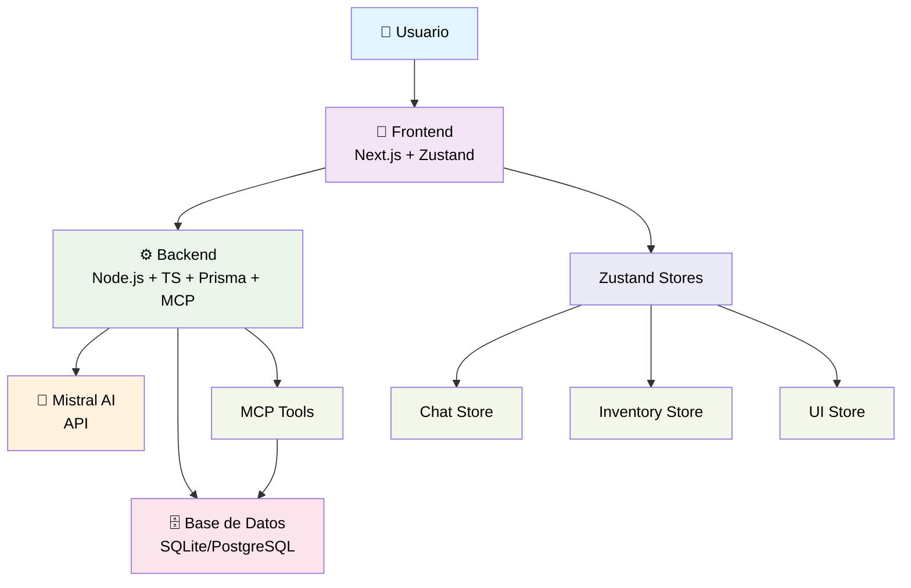

# 💄 Asistente de Inventario con IA (Cosméticos)

[](https://opensource.org/licenses/MIT)
[](https://nodejs.org/)
[](https://www.typescriptlang.org/)
[](https://www.prisma.io/)

🤖 **Asistente de inventario con inteligencia artificial orientado a tiendas de cosméticos y perfumerías.**
Permite consultar stock, analizar ventas y recibir recomendaciones automáticas de reposición a través de una interfaz tipo chat + dashboard, usando un stack moderno (Node.js, TypeScript, Prisma, API de Mistral AI y MCP).

## 📊 Estado del Proyecto

- ✅ **Documentación completa** - Arquitectura, features, instalación, roadmap.
- 🚧 **Implementación en desarrollo** - Backend, MCP, integración Mistral API, UI.

Este proyecto aplica **Spec-Driven Development (SDD)**, es decir, un enfoque doc‑first donde se redactan las especificaciones completas antes de la implementación. Está pensado como **prototipo de portfolio** para mostrar habilidades de:
- 🧠 IA aplicada a un caso real de negocio.
- ⚙️ Backend moderno + base de datos + lógica de negocio.
- 🔗 Orquestación de herramientas vía Model Context Protocol (MCP).
- 🎨 Diseño de una UI simple orientada a usuarios no técnicos.

> **Nota:** Este `README.md` es un resumen. Para una inmersión profunda, puedes consultar el [**mapa completo de la documentación**](./docs/README.md).

## 📋 Índice

- [📖 Descripción general](#descripción-general)
- [🚀 Quick Demo (diseño)](#quick-demo-diseño)
- [✨ Características principales](#características-principales)
- [🏗️ Arquitectura y Stack](#arquitectura-y-stack)
- [🗄️ Modelo de datos y Lógica de negocio](#modelo-de-datos-y-lógica-de-negocio)
- [🤖 IA y Orquestación con MCP](#ia-y-orquestación-con-mcp)
- [🖥️ Interfaz de usuario (UI)](#interfaz-de-usuario-ui)
- [🚀 Instalación y Uso](#instalación-y-uso)
- [⚠️ Limitaciones y Roadmap](#limitaciones-y-roadmap)
- [🏛️ Organización del Proyecto](#organización-del-proyecto)
- [📁 Estructura del Repositorio](#estructura-del-repositorio)
- [📜 Licencia](#licencia)

## 📖 Descripción general

Este proyecto aborda la gestión de inventario ineficiente en pymes de cosmética, reemplazando la intuición y las hojas de cálculo por un asistente de IA que ofrece recomendaciones de reposición basadas en datos. El objetivo es construir un sistema end-to-end que demuestre habilidades de producto y de ingeniería de software.

> [Lee la descripción completa del problema y la solución en **docs/overview.md &raquo;**](./docs/overview.md)

## 🚀 Quick Demo (diseño)

Esta sección muestra cómo funcionará la aplicación una vez implementada:

```
┌─────────────────┬───────────────────────────────┐
│ 📊 Dashboard   │ 💬 Chat con IA                 │
├─────────────────┼───────────────────────────────┤
│ 🟢 Serum X      │ Usuario: ¿Qué reponer?        │
│ 🟡 Crema Y      │                               │
│ 🔴 Labial Z     │ IA: Esta semana conviene      │
│ 📈 Top Ventas   │ reponer 15 unidades del Serum │
│ 1. Serum X      │ X. Stock actual: 8 unidades.  │
│ 2. Crema Y      │                               │
└─────────────────┴───────────────────────────────┘
```

## ✨ Características principales

El asistente permite realizar consultas en lenguaje natural sobre el stock, recibir recomendaciones de reposición y visualizar el estado del inventario con alertas de productos críticos o estancados. La IA es capaz de justificar sus respuestas basándose en datos de ventas y umbrales predefinidos.

> [Consulta todas las características y casos de uso en **docs/features.md &raquo;**](./docs/features.md)

## 🧪 Demo pública de IA avanzada

Puedes probar el clasificador de tools MCP (fine-tuneado por mí) en este Hugging Face Space público:

[https://huggingface.co/spaces/marioxasas/tool-classifier-mcp-demo](https://huggingface.co/spaces/marioxasas/tool-classifier-mcp-demo)

Ejemplo:
Consulta: "¿Qué productos están por agotarse?"
Tool sugerida: `getLowStockReport`

## 🏗️ Arquitectura y Stack

El sistema se compone de un frontend en **Next.js**, un backend en **Node.js/TypeScript** con un servidor MCP integrado y **Prisma ORM**. La base de datos propuesta es SQLite para desarrollo y PostgreSQL para producción. Esta elección de stack es moderna, robusta y ampliamente reconocida en la industria.



> [Explora el diagrama de arquitectura, el flujo de datos y el stack completo en **docs/architecture.md**](./docs/architecture.md) y [**docs/stack.md &raquo;**](./docs/stack.md)

## 🗄️ Modelo de datos y Lógica de negocio

El núcleo del sistema es una tabla `Product` que almacena información clave como stock, ventas, precios y umbrales. Sobre estos datos se aplican reglas de negocio simples para calcular proyecciones de demanda, detectar riesgo de quiebre de stock e identificar productos estancados.

> [Analiza el esquema de la base de datos en **docs/model.md**](./docs/model.md) y [las reglas de negocio en **docs/logic.md &raquo;**](./docs/logic.md)

## 🤖 IA y Orquestación con MCP

Se utiliza la API de **Mistral AI** como motor de razonamiento. Un servidor **MCP (Model Context Protocol)** integrado en el backend expone `tools` de solo lectura (como `getLowStockReport`) que la IA utiliza para consultar la base de datos y fundamentar sus respuestas.

> [Conoce las tools disponibles y el rol del asistente en **docs/mcp.md &raquo;**](./docs/mcp.md)

## 🖥️ Interfaz de usuario (UI)

La UI está diseñada para ser simple e intuitiva, combinando un **dashboard visual** con alertas y una **interfaz de chat conversacional**. El estado de la interfaz se gestionará con **Zustand**. Además, se ha planificado un futuro módulo CRUD para la gestión completa de productos por parte del usuario final.

> [Visualiza el diseño de la UI y sus componentes en **docs/ui.md &raquo;**](./docs/ui.md)

## 🚀 Instalación y Uso

La configuración del proyecto requiere Node.js y una API key de Mistral. El proceso está separado para el backend y el frontend, y se detallan los comandos de instalación de dependencias, configuración de variables de entorno y ejecución de la aplicación.

> [Sigue los pasos detallados en **docs/installation.md**](./docs/installation.md) y [ve ejemplos de uso en **docs/usage.md &raquo;**](./docs/usage.md)

## ⚠️ Limitaciones y Roadmap

Como prototipo de portfolio, el proyecto tiene limitaciones claras: no incluye gestión de usuarios, multi-tenancy ni integraciones con ERPs. El roadmap futuro contempla añadir estas funcionalidades, junto con predicción de demanda avanzada y un módulo CRUD de productos.

> [Revisa las limitaciones en **docs/limitations.md**](./docs/limitations.md) y [el roadmap completo en **docs/roadmap.md &raquo;**](./docs/roadmap.md)

## 🏛️ Organización del Proyecto

Este proyecto se gestiona con una metodología disciplinada para garantizar la calidad y la transparencia. Cada funcionalidad se planifica como un **Issue** en GitHub y se agrupa en **Milestones**. El trabajo se integra a través de **Pull Requests** con auto-revisión, demostrando la aplicación de prácticas profesionales incluso en un proyecto individual.

> [Conoce la metodología de desarrollo en **docs/project-management.md &raquo;**](./docs/project-management.md)

## 📁 Estructura del Repositorio

La estructura del código está organizada en dos carpetas principales, `backend` y `frontend`, con subdirectorios que siguen principios como SRP (Single Responsibility Principle) y una clara separación de componentes, lógica y estado.

> [Explora la estructura detallada del repositorio en **docs/structure.md &raquo;**](./docs/structure.md)

## 📜 Licencia

Este proyecto está licenciado bajo la **licencia MIT**. Consulta el archivo [`LICENSE`](LICENSE) para más detalles.
